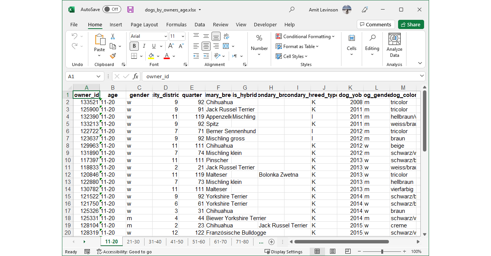

```{r setup, include=FALSE}
knitr::opts_chunk$set(echo = TRUE, message = FALSE, warning = FALSE)
```


### Introduction

On March 16, 2022, [Analysis Paralysis](https://www.facebook.com/go.analysis.paralysis) & [Amit Levinson](https://amitlevinson.com/) live streamed an R vs/and python data analysis session.  

You can find below the questions along with solutions in each programming language. The files are available for download in the button below, or in Amit's GitHub [folder for the live](https://github.com/AmitLevinson/streaming/tree/main/r_and_python).  

Solved it? Enjoyed? Have feedback? Let us know! We'd love to hear!

Also, check out the full recording


```{r, echo = FALSE}
library(reticulate)
library(downloadthis)
```

```{r echo = FALSE}
download_link(
  link = 'https://github.com/AmitLevinson/streaming/raw/main/r_and_python/split_data.zip',
  output_name = "Files from downloadthis",
  button_label = "Download files",
  button_type = "default",
  has_icon = TRUE,
  icon = "fa fa-save",
  self_contained = FALSE
)
```


##### Loading libraries

```{python}
import pandas as pd
import numpy as np
import os
import matplotlib.pyplot as plt
import seaborn as sns
```


```{r}
library(purrr)
library(dplyr)
library(readr)
library(tidyr)
library(ggplot2)
library(tidytext)
library(reticulate)
```


#### 1. Load the files into memory and conccat them into a single Dataframe

<details>
  <summary> Solution </summary>

##### Python

```{python}
all_files = []
for file in os.listdir("split_data/"):
    if not file.endswith("csv"):
        continue
    all_files.append(pd.read_csv("split_data/"+file))

df = pd.concat(all_files, ignore_index=True)

df
```

##### R

```{r}
files <- paste0("split_data/",list.files(path = "split_data/"))
dogs <- map_dfr(files, read_csv, col_types = cols())

dogs
```

</details>

#### 2. Describe the data using a summary function of sort {.tabset}

<details>
  <summary> Solution </summary>

##### Python

```{python}
df.describe(percentiles=[0.2,0.8])
```


##### R

```{r}
skimr::skim(dogs)
```

</details>

##### 3. What are the top 10 most common colors? Each color should be  counted separately, i.e. black/brown should be counted as 1 black, 1 brown. {.tabset}

<details>
  <summary> Solution </summary>

###### Python

```{python}
melted = df['dog_color'].str.split("/", expand=True).melt().copy()

melted['value'].value_counts()
```


###### R 

```{r}
dogs %>% 
  transmute(
    new_color = strsplit(dog_color, split = "/")
    ) %>% 
  unnest() %>% 
  count(new_color, sort = T)
```

</details>


#### 4. What are the top 10 most common primary breeds by dog gender? Visualize it using a corresponding bar plot {.tabset}

<details>
  <summary> Solution </summary>


##### Python

```{python}
main_table = df[['dog_gender','primary_breed']].pivot_table(index='primary_breed', columns='dog_gender', aggfunc=len).copy()
```

```{python}
sorted_by_w = main_table.sort_values('w', ascending=False).head(10).copy()
sorted_by_m = main_table.sort_values('m', ascending=False).head(10).copy()
```


```{python}
fig, axes = plt.subplots(1,2)

fig.suptitle("This is a title", fontsize=18)

sorted_by_w.plot(kind='bar', rot=40, color=["pink", "teal"], ax=axes[0], figsize=(20,5))
sorted_by_m.plot(kind='bar', rot=40, color=["pink", "teal"], ax=axes[1], figsize=(20,5))
```

##### R

```{r}
dogs %>% 
  count(dog_gender, primary_breed, sort = T) %>% 
  group_by(dog_gender) %>% 
  slice(1:10) %>% 
  ggplot(aes(y = reorder_within(primary_breed, by =  n, within = dog_gender), x = n)) +
  geom_col() +
  facet_wrap(vars(dog_gender), scales = "free_y") +
  scale_y_reordered() +
  labs(y = NULL, title = "This is a title")+
  theme_minimal()
```

</details>

#### 5. Who (owner) has dogs with the largest age gap between them? What’s the gap value? {.tabset}

<details>
  <summary> Solution </summary>

##### Python

```{python}
df['dog_dob'] = pd.to_datetime(df['dog_dob'])
gb = df[['owner_id', 'dog_dob']].groupby('owner_id').agg([min, max])

gb.columns = ["_".join(list(x)) for x in gb.columns]

gb['diff'] = (gb['dog_dob_max']-gb['dog_dob_min']).dt.days

gb.sort_values('diff').tail(1)
```

##### R

```{r}
dogs %>% 
  group_by(owner_id) %>% 
  filter(
    n() > 1,
    dog_dob == min(dog_dob) | dog_dob == max(dog_dob)
  ) %>% 
  select(owner_id, dog_dob) %>% 
  arrange(owner_id, dog_dob) %>% 
  summarise(
    timediff = difftime(dog_dob, time2 = lag(dog_dob), units = "days")
  ) %>% 
  fill(timediff, .direction = "up") %>% 
  arrange(-timediff)
```

**Another solution suggested by [Adi Sarid](https://adisarid.github.io/)**
```{r}
dogs %>% 
  group_by(owner_id) %>% 
  summarise(age_gap = max(dog_dob) - min(dog_dob)) %>% 
  arrange(desc(age_gap))
```

</details>


#### 6. Save the Dataframe into an excel file where each sheet is a different age-group of owners {.tabset}

<details>
  <summary> Solution </summary>

##### Python

```{python eval = FALSE}

writer = pd.ExcelWriter("dogs_by_owner_age_python.xlsx")


for age in df['age'].fillna("None").unique():
    temp_df = df[df['age']==age].copy()
    temp_df.to_excel(writer, sheet_name=age)

writer.save()
```

##### R

```{r eval = FALSE}
dogs %>% 
  split(.$age) %>% 
  writexl::write_xlsx(path = "dogs_by_owners_age.xlsx")
```

##### Output




</details>